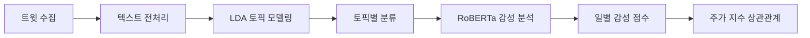

# 🤖 AI Modeling

> 트윗 기반 IT 기업 감성 분석을 위한 AI 모델링 파이프라인

[](https://python.org)
[](https://pytorch.org)
[](https://huggingface.co)
[](https://wandb.ai)

---

## 📋 프로젝트 개요

본 프로젝트는 **트윗 데이터**를 활용하여 IT 기업에 대한 대중의 감성을 분석하고, 이를 주가 지수와의 상관관계 분석에 활용하는 AI 모델링 파이프라인입니다.

### 🎯 주요 목표
- LDA 토픽 모델링을 통한 주요 토픽 추출
- RoBERTa 기반 딥러닝 모델을 활용한 감성 분류
- 감성 점수와 주가 지수(S&P500, NASDAQ100) 간 상관관계 분석

---

## 🏗️ 프로젝트 구조

```
AI Modeling/
├── 📁 lda-topic-sentiment/     # LDA 토픽 모델링 + 감성 분석
│   ├── lda.py                  # LDA 모델 학습
│   ├── sentiment.py            # 감성 분석
│   ├── get_score.py            # 감성 점수 계산
│   └── etc/
│       ├── correlation.py      # Pearson 상관계수 계산
│       ├── preproc.py          # 텍스트 전처리
│       └── utils.py            # 유틸리티 함수
│
├── 📁 tweet-sa-roberta/        # RoBERTa 감성 분석 모델
│   ├── train.py                # 모델 학습
│   ├── test.py                 # 모델 평가
│   ├── sweep/                  # 하이퍼파라미터 튜닝
│   │   └── wandb_sweep.ipynb   # W&B Sweep 실험
│   └── util/
│       ├── models.py           # 모델 정의
│       ├── dataset.py          # 데이터셋 클래스
│       └── dataloader.py       # 데이터로더
│
├── 📁 topic-modeling/          # 토픽 모델링 단독 모듈
│   ├── train.py                # 토픽 모델 학습
│   ├── get_topic.py            # 토픽 추출
│   └── get_model.py            # 모델 로드
│
├── 📁 mlm-modeing/             # Masked Language Modeling
│   ├── mlm.sh                  # MLM 학습 스크립트
│   └── mlm_t5.sh               # T5 기반 MLM
│
└── 📓 Senty_Project.ipynb      # 전체 파이프라인 노트북
```

---

## 🔬 기술 스택

### 토픽 모델링
| 기술 | 설명 |
|------|------|
| **LDA (Latent Dirichlet Allocation)** | 트윗에서 잠재 토픽 추출 |
| **Gensim** | 토픽 모델링 라이브러리 |

### 감성 분석
| 기술 | 설명 |
|------|------|
| **RoBERTa-base** | 사전학습된 Transformer 모델 |
| **Fine-tuning** | 트윗 감성 분류를 위한 미세조정 |
| **3-class Classification** | 긍정 / 부정 / 중립 분류 |

### 상관관계 분석
| 기술 | 설명 |
|------|------|
| **Pearson 상관계수** | `scipy.stats.pearsonr` 사용 |
| **Window Size** | 3일, 5일, 7일 이동 평균 적용 |

---

## 📊 분석 파이프라인



### 1️⃣ LDA 토픽 모델링
```python
# 9개 토픽 추출
from gensim.models import LdaModel

lda_model = LdaModel(
    corpus=corpus,
    num_topics=9,
    id2word=dictionary,
    passes=15
)
```

### 2️⃣ RoBERTa 감성 분석
```python
from transformers import AutoModelForSequenceClassification

model = AutoModelForSequenceClassification.from_pretrained(
    "roberta-base",
    num_labels=3  # 긍정, 부정, 중립
)
```

### 3️⃣ 일별 감성 점수 계산
```python
# 감성 점수 공식
Score = ((긍정 수 - 부정 수) / 전체 트윗) × (1 - 중립 비율)
```

### 4️⃣ Pearson 상관계수
```python
from scipy import stats

correlation, p_value = stats.pearsonr(sentiment_scores, stock_index)
```

---

## 🚀 실행 방법

### 환경 설정
```bash
# 의존성 설치
pip install -r lda-topic-sentiment/requirements.txt

# 환경 변수 설정
export HF_TOKEN="your_huggingface_token"
export WANDB_TOKEN="your_wandb_token"
```

### LDA 토픽 모델링
```bash
cd lda-topic-sentiment
python main.py
```

### RoBERTa 감성 분석 학습
```bash
cd tweet-sa-roberta
bash train.sh
```

### 하이퍼파라미터 튜닝 (W&B Sweep)
```bash
cd tweet-sa-roberta/sweep
# Jupyter Notebook 실행
jupyter notebook wandb_sweep.ipynb
```

---

## 📈 실험 결과

### 감성 분석 모델 성능
| Metric | Score |
|--------|-------|
| **Accuracy** | 72.3% |
| **F1-Score** | 0.71 |

### 상관관계 분석 결과
| 토픽 | S&P500 상관계수 | NASDAQ100 상관계수 |
|------|----------------|-------------------|
| GPU | **-0.68** | -0.62 |
| Apple | -0.45 | -0.41 |
| AI/ML | -0.38 | -0.35 |

> 💡 **주요 발견**: GPU 토픽에서 가장 강한 음의 상관관계(-0.68)가 발견됨

---

## 📦 데이터셋

| 데이터 | 설명 |
|--------|------|
| **수집 기간** | 2023.05.23 ~ 2023.06.15 |
| **총 트윗 수** | ~50,000개 |
| **분석 대상** | 5개 IT 기업 |
| **추출 토픽** | 9개 |

---

## 🔗 관련 레포지토리

- [📊 Frontend](https://github.com/inisw-8/frontend) - React 대시보드
- [🖥️ Web Server](https://github.com/inisw-8/web-server) - FastAPI 백엔드
- [📥 Data Gathering](https://github.com/inisw-8/data-gathering) - 데이터 수집

---

## 📄 라이선스

MIT License

---

<div align="center">

**Senty Project** - 트윗 기반 IT 기업 감성 분석 📊

</div>

