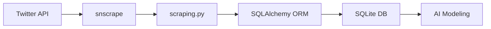

# 📥 Data Gathering

> IT 기업 관련 트윗 데이터 수집 파이프라인

[](https://python.org)
[](https://sqlite.org)
[](https://sqlalchemy.org)

---

## 📋 프로젝트 개요

본 모듈은 **Twitter(X)** 에서 IT 기업 관련 트윗을 수집하여 SQLite 데이터베이스에 저장하는 데이터 수집 파이프라인입니다.

### 🎯 수집 대상 기업

| 기업 | 검색 쿼리 |
|------|----------|
| 🍎 **Apple** | `#Apple`, `@Apple` |
| 📦 **Amazon** | `amazon` |
| 💻 **Microsoft** | `microsoft` |
| 🔍 **Google** | `google` |
| 🎮 **NVIDIA** | `nvidia` |

---

## 🏗️ 프로젝트 구조

```
Data Gathering/
├── 📄 scraping.py      # 트윗 스크래핑 메인 스크립트
├── 📄 models.py        # SQLAlchemy ORM 모델 정의
├── 📄 database.py      # 데이터베이스 연결 설정
├── 📄 preproc.py       # 텍스트 전처리 유틸리티
└── 📁 databases/       # SQLite DB 저장 폴더
    └── raw_total.db    # 수집된 트윗 데이터
```

---

## 🔬 기술 스택

| 기술 | 설명 |
|------|------|
| **snscrape** | Twitter 스크래핑 라이브러리 |
| **SQLAlchemy** | Python ORM |
| **SQLite** | 경량 데이터베이스 |

---

## 📊 데이터 스키마

### Tweet 테이블

```python
class Tweet(Base):
    __tablename__ = 'tweet'

    id = Column(Integer, primary_key=True)       # 트윗 고유 ID
    tweetDate = Column(DateTime)                  # 트윗 작성 시간
    createdDate = Column(DateTime)                # DB 저장 시간
    rawContent = Column(Text)                     # 원본 트윗 내용
    renderedContent = Column(Text)                # 렌더링된 내용
    lang = Column(Text)                           # 언어
    url = Column(Text)                            # 트윗 URL
    replyCount = Column(Integer)                  # 답글 수
    retweetCount = Column(Integer)                # 리트윗 수
    likeCount = Column(Integer)                   # 좋아요 수
    quoteCount = Column(Integer)                  # 인용 수
    viewCount = Column(Integer)                   # 조회수
    hashtags = Column(Text)                       # 해시태그
    companyName = Column(Text)                    # 대상 기업명
```

---

## 🚀 실행 방법

### 1. 환경 설정

```bash
# 의존성 설치
pip install snscrape sqlalchemy

# 데이터베이스 폴더 생성
mkdir databases
```

### 2. 스크래핑 실행

```bash
python scraping.py
```

> ⚠️ **참고**: 스크립트는 무한 루프로 실행되며, 각 기업에 대해 연속적으로 트윗을 수집합니다. 중복 트윗이 200번 연속 발생하면 해당 기업 수집을 중단합니다.

---

## 📈 수집 통계

| 항목 | 값 |
|------|-----|
| **수집 기간** | 2023.05.23 ~ 2023.06.15 |
| **총 트윗 수** | ~50,000개 |
| **대상 기업** | 5개 |
| **언어** | 영어 (주요) |

---

## 🔄 데이터 흐름



---

## 💡 주요 기능

### 1. 중복 처리
```python
try:
    session.add(t)
    session.commit()
except IntegrityError:
    session.rollback()  # 중복 트윗 무시
```

### 2. 자동 중단 로직
```python
if no_change_cnt > 199:  # 200번 연속 중복 시 중단
    print('too many conflicts with tweets in db')
    break
```

### 3. 다중 쿼리 지원
```python
# Apple의 경우 해시태그와 멘션 모두 수집
scrape_twitter('#Apple', company)
scrape_twitter('@Apple', company)
```

---

## 🔗 관련 레포지토리

- [🤖 AI Modeling](https://github.com/inisw-8/ai-modeling) - 토픽 모델링 & 감성 분석
- [📊 Frontend](https://github.com/inisw-8/frontend) - React 대시보드
- [🖥️ Web Server](https://github.com/inisw-8/web-server) - FastAPI 백엔드

---

## 📄 라이선스

MIT License

---

<div align="center">

**Senty Project** - 트윗 기반 IT 기업 감성 분석 📊

</div>

