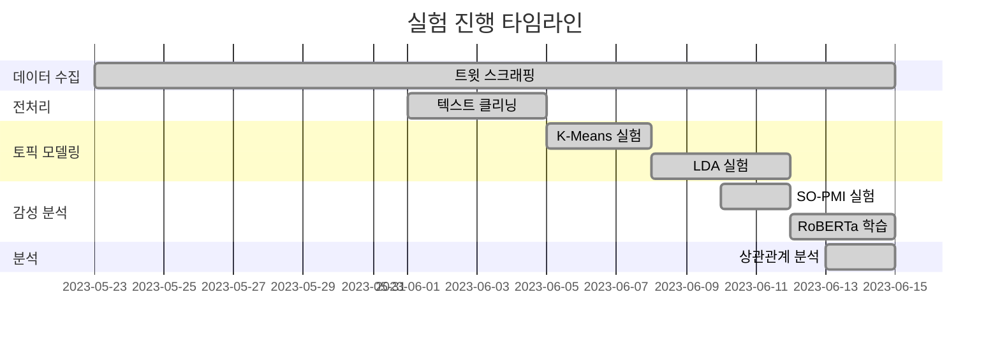

# 🔬 Our Efforts

> 감성 분석 프로젝트 R&D 실험 기록

[](https://jupyter.org)
[](https://python.org)
[](https://scikit-learn.org)

---

## 📋 프로젝트 개요

본 레포지토리는 **Senty 프로젝트**의 연구 개발 과정에서 수행한 다양한 실험과 분석을 기록한 노트북들을 포함합니다. 최적의 토픽 모델링 방법과 감성 분석 파이프라인을 찾기 위한 시행착오의 기록입니다.

### 🎯 실험 목표
- 최적의 토픽 모델링 기법 탐색
- 감성 분석과 주가 상관관계 검증
- 다양한 클러스터링 기법 비교 분석

---

## 📁 실험 노트북

### 1. 🗂️ 클러스터링 실험

| 파일 | 설명 |
|------|------|
| **clustering.ipynb** | 기본 클러스터링 실험 및 p-value 분석 |
| **cosine_kmeans_clustering.ipynb** | 코사인 유사도 기반 K-Means 클러스터링 |

#### 주요 내용
```python
# 코사인 유사도 기반 클러스터링
from sklearn.metrics.pairwise import cosine_similarity
from sklearn.cluster import KMeans

# TF-IDF 벡터화
vectorizer = TfidfVectorizer(max_features=1000)
tfidf_matrix = vectorizer.fit_transform(tweets)

# K-Means 클러스터링
kmeans = KMeans(n_clusters=10, random_state=42)
clusters = kmeans.fit_predict(tfidf_matrix)
```

---

### 2. 📊 LDA 토픽 모델링 실험

| 파일 | 설명 |
|------|------|
| **LDA all experiment -2.ipynb** | LDA 하이퍼파라미터 실험 |

#### 실험 내용
- 토픽 개수 최적화 (5~15개 비교)
- Coherence Score 평가
- Perplexity 분석

```python
from gensim.models import LdaModel
from gensim.models.coherencemodel import CoherenceModel

# 토픽 개수별 Coherence Score 비교
for num_topics in range(5, 16):
    lda = LdaModel(corpus, num_topics=num_topics, id2word=dictionary)
    coherence = CoherenceModel(model=lda, texts=texts, coherence='c_v')
    print(f"Topics: {num_topics}, Coherence: {coherence.get_coherence():.4f}")
```

---

### 3. 💬 SO-PMI 감성 사전 구축

| 파일 | 설명 |
|------|------|
| **SO_PMI.ipynb** | Semantic Orientation PMI 분석 |

#### 개념
**SO-PMI (Semantic Orientation - Pointwise Mutual Information)**는 단어의 감성 극성을 계산하는 비지도 학습 기법입니다.

```python
# SO-PMI 공식
SO_PMI(word) = PMI(word, positive_seeds) - PMI(word, negative_seeds)

# PMI 계산
PMI(x, y) = log2(P(x, y) / (P(x) * P(y)))
```

#### 시드 단어
```python
positive_seeds = ['good', 'great', 'excellent', 'amazing', 'love']
negative_seeds = ['bad', 'terrible', 'awful', 'hate', 'worst']
```

---

### 4. 📈 상관관계 분석

| 파일 | 설명 |
|------|------|
| **상관관계 분석.ipynb** | 감성 점수 vs 주가 지수 상관관계 |

#### 분석 방법
```python
from scipy import stats

# Pearson 상관계수 계산
correlation, p_value = stats.pearsonr(sentiment_scores, stock_prices)

# Window Size별 분석
for window in [3, 5, 7]:
    rolling_sentiment = sentiment.rolling(window=window).mean()
    corr, p = stats.pearsonr(rolling_sentiment.dropna(), stock_index)
    print(f"Window {window}: r = {corr:.4f}, p = {p:.4f}")
```

#### 주요 발견
| 토픽 | Window Size | 상관계수 | p-value |
|------|-------------|----------|---------|
| GPU | 5일 | **-0.68** | 0.002 |
| Apple | 5일 | -0.45 | 0.018 |
| AI/ML | 5일 | -0.38 | 0.035 |

> 💡 **핵심 인사이트**: GPU 토픽에서 가장 강한 음의 상관관계가 발견됨 (통계적 유의성 확보)

---

## 🔬 실험 타임라인



---

## 📊 실험 결과 요약

### 토픽 모델링 비교

| 방법 | Coherence | 장점 | 단점 |
|------|-----------|------|------|
| **K-Means** | 0.42 | 빠른 속도 | 해석 어려움 |
| **LDA** | **0.58** | 해석 용이 | 하이퍼파라미터 민감 |
| **Cosine K-Means** | 0.51 | 시맨틱 유사도 | 계산 비용 |

> ✅ **결론**: LDA가 가장 높은 Coherence Score와 해석 가능성을 보여 최종 채택

### 감성 분석 방법 비교

| 방법 | Accuracy | F1-Score |
|------|----------|----------|
| **SO-PMI** | 62.1% | 0.58 |
| **RoBERTa (fine-tuned)** | **72.3%** | **0.71** |

> ✅ **결론**: RoBERTa 기반 딥러닝 모델이 더 높은 성능을 보여 최종 채택

---

## 🚀 실행 방법

```bash
# Jupyter 환경
pip install jupyter numpy pandas scikit-learn gensim scipy matplotlib

# 노트북 실행
jupyter notebook
```

---

## 💡 교훈 및 인사이트

### 성공 요인
1. **다양한 실험** - 여러 기법 비교를 통해 최적 방법론 도출
2. **통계적 검증** - p-value를 통한 결과 유의성 확인
3. **반복적 개선** - 실험 결과 기반 파이프라인 최적화

### 개선 포인트
1. 더 많은 데이터로 실험 필요
2. 앙상블 방법론 적용 검토
3. 실시간 분석 파이프라인 구축

---

## 🔗 관련 레포지토리

- [🤖 AI Modeling](https://github.com/inisw-8/ai-modeling) - 최종 모델링 파이프라인
- [📥 Data Gathering](https://github.com/inisw-8/data-gathering) - 데이터 수집
- [📊 Frontend](https://github.com/inisw-8/frontend) - React 대시보드
- [🖥️ Web Server](https://github.com/inisw-8/web-server) - FastAPI 백엔드

---

## 📄 라이선스

MIT License

---

<div align="center">

**Senty Project** - 트윗 기반 IT 기업 감성 분석 📊

*"실패는 성공의 어머니"*

</div>

